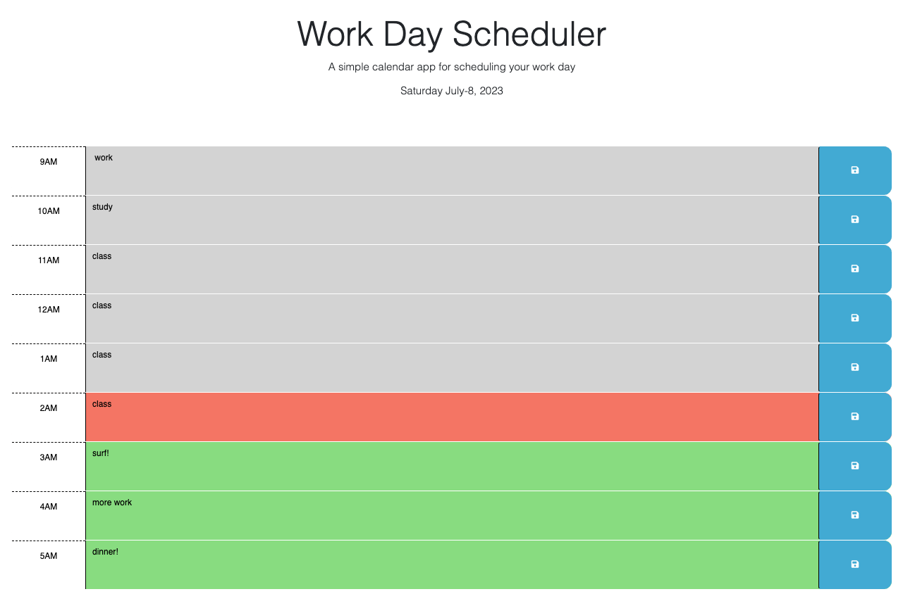

# work-day-scheduler

## Description
    For this project, I applied my new skills of local storage as well as practice with the jQuery library.
    It is a simple planner where you can modify each text area with a to do list, for example, and can save
    this list with the blue "save" button on the right. When you refresh the page, the items should still be there! I also used the day.js() library in order to color code times of the day which indicate past (grey),
    present (red), and future (green).
    
## Technologies
    HTML/CSS/JavaScript/jQuery/Bootstrap

## Credits
    Thank you to UC Berkeley Extension Full Stack course, partnered with EDX, for the starte code.
## Screenshot / Link to Application

[Visit my deployed application!](https://www.openai.com/)
